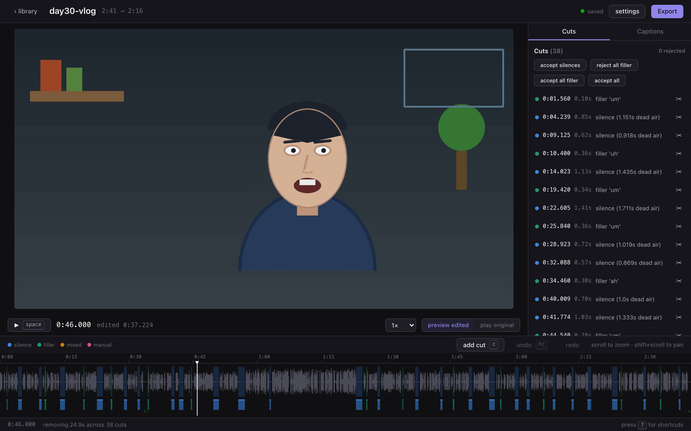
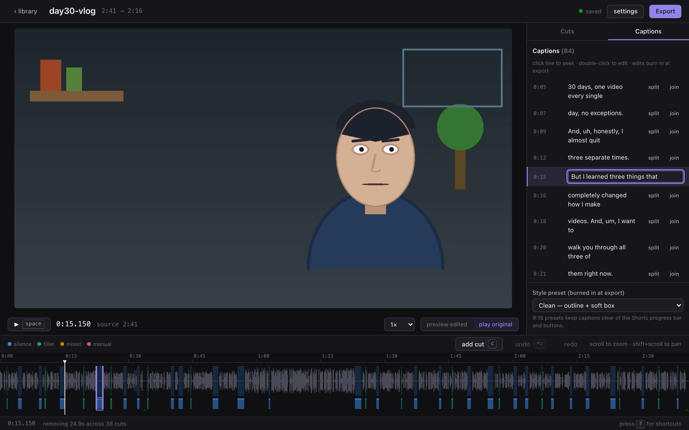
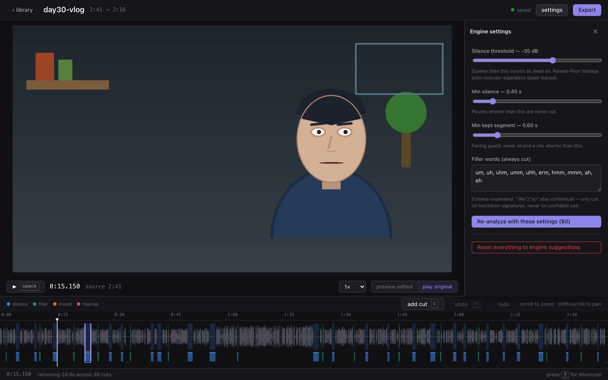
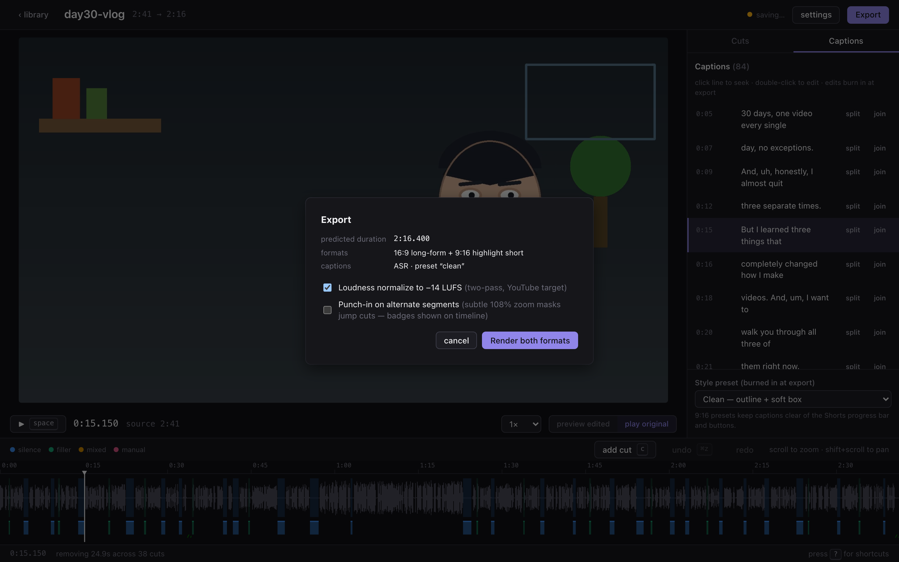

# vlog-pipeline

Raw vlog footage + a topic → an edited, captioned, multi-format, upload-ready video
package. A CLI build-pipeline plus a local review studio: every stage writes its
output to `runs/<name>/` as files (JSON state, markdown reports, media), each stage
must pass a validation gate before the next one runs, and the expensive editing
engine is fully local and deterministic — LLM calls are reserved for cheap,
low-frequency text stages.

```
vlog-pipeline run --footage clip.mp4 --topic "Three lessons from my first 30 days of daily vlogging"
vlog-pipeline ui          # review the cuts in the studio, then export — local, $0
vlog-pipeline status
```

## The review studio

`vlog-pipeline ui` opens a local, fully offline editing studio (no CDN, no external
requests, zero LLM calls — repeat editing costs $0):



- **Timeline** — waveform of the original footage with every proposed cut
  color-coded by reason (silence / filler / mixed / manual, the same
  colorblind-safe set as report.html); zoom around the cursor, pan, click-to-seek,
  drag the accent handles to nudge boundaries, drag a range to add a manual cut.
- **Render-free preview** — plays the ORIGINAL file and skips removed segments live
  from the current decision state (measured boundary accuracy: 2ms entry overshoot
  against a 50ms target). Toggle "preview edited" ↔ "play original" any time.
- **Cut review** — keep/reject per cut (`x`), batch ops ("reject all filler"),
  50ms nudges, full undo/redo, autosave. The engine's EDL is never mutated: your
  decisions live in `review-state.json` layered on top, so "reset to engine
  suggestions" always works.
- **Caption editor** — synced line list, double-click to fix ASR mistakes,
  split/join lines, style presets for the 9:16 UI-safe zone. Lines are anchored to
  original-footage time, so changing cuts can never desync them.
- **Re-analyze** — change thresholds/filler list and re-run the local engine;
  decisions carry over by time-overlap matching, changed suggestions are flagged
  NEW, and nothing is ever silently overridden (measured: 38/38 carried, 1 flagged).
- **Export** — renders both formats from your decisions via the engine, with
  two-pass loudness normalization to −14 LUFS (default on) and an optional
  punch-in zoom alternation that masks jump cuts (default off). Everything is
  keyboard-first — press `?` for the overlay.

| | |
|---|---|
|  |  |
|  |  |

**Measured end-to-end** (Playwright suite, `pytest tests/e2e -m e2e`): reject cuts +
nudge + manual cut → exported 16:9 equals the frame-quantized prediction within
67ms (±0.1s target); a rejected filler's audio is verifiably present at its mapped
timestamp (RMS above the −35dBFS speech-presence gate); editing a caption changes both the .srt and the
burned pixels at that caption's midpoint; loudness lands at −14.2/−14.1 LUFS.
The production web build is committed (`vlog_pipeline/webdist`), so a fresh clone
serves the studio with no node toolchain — verified by a clean-machine smoke test.

## What it produces

| output | what it is |
|---|---|
| `final/long-169.mp4` | 16:9 long-form cut: silence + filler words removed, styled burned-in captions |
| `final/short-916.mp4` | 9:16 Shorts/Reels cut of the auto-detected highlight, subject-tracking crop, Shorts-safe captions |
| `captions.srt` | separate subtitle file synced to the edited cut |
| `edit-report.md` | before/after durations + a diff table of every cut (timestamp, duration, reason) |
| `edit-decisions.json` | full machine-readable EDL, filler list, highlight-scoring curve |
| `review-report.md` | LLM review of the final cut against the original plan (structure / runtime / pacing) |
| `plan.md`, `optimize.md` | production plan; title variants, thumbnail text, description, tags |
| `report.html` | self-contained offline run report: embedded players, color-coded cut timeline, caption preview, cost table, thumbnails, verdict banner — double-click to open |
| `thumbnails/` | 8 frames from the long cut + 4 from the short, for eyeball validation |

## Model routing

```
            ┌─────────┐   ┌─────────┐   ┌─────────┐   ┌─────────┐   ┌─────────┐   ┌─────────┐
 topic ───► │  plan   │ ─►│ ingest  │ ─►│  edit   │ ─►│ caption │ ─►│ package │ ─►│optimize │
 footage ─► │ Sonnet  │   │  local  │   │  local  │   │  local  │   │ Sonnet  │   │  Haiku  │
            │ metered │   │ ffprobe │   │ whisper │   │ Pillow  │   │ metered │   │ metered │
            └─────────┘   │silencedet│  │ ffmpeg  │   │ ffmpeg  │   └─────────┘   └─────────┘
                          └─────────┘   │ OpenCV  │   │ OpenCV  │
                                        └─────────┘   └─────────┘
                                        └── stage-gated: each stage's validation must pass ──┘
```

**Billing is explicit by design.** The Sonnet/Haiku stages spawn headless `claude -p`
subprocesses, which bill against `ANTHROPIC_API_KEY` (metered API) whenever it is set —
they are **not** covered by an interactive session's subscription quota. The CLI prints
a routing/billing table before running so this is never silent. The engine stages
(edit/caption) never call an LLM: repeat runs cost $0 in LLM spend, and `--skip-llm`
runs the whole media path for free.

## The edit engine (stage 3–4, all local signal analysis)

- **Silence/dead-air removal** — ffmpeg `silencedetect` builds a silence map; gaps are
  cut with configurable threshold/padding into a jump-cut assembly.
- **Filler-word removal** — faster-whisper (local, word-level timestamps) finds "um",
  "uh", etc.; contextual fillers ("like", "so") are only cut when whisper's confidence
  and duration signatures say hesitation. Cuts are frame-accurate with 10 ms audio
  fades at every join so nothing clicks.
- **Pacing guard** — cuts that would strand a segment shorter than `min_segment` are
  cancelled (silence restored in preference to restoring a filler); the edit report
  lists every cancelled cut and why.
- **Captions synced by construction** — the word timestamps are remapped exactly
  through the cutlist onto the edited timeline (no second transcription pass, no
  drift), then grouped into readable lines → `.srt` + styled burn-in (bold white,
  black stroke, rounded translucent box; raised above the Shorts UI zone on 9:16).
- **Highlight detection** — segments scored by audio RMS energy + speech rate; the
  best ~50 s window (snapped to word boundaries) becomes the short.
- **Smart vertical crop** — OpenCV Haar face detection with a motion-centroid
  fallback per sample, EMA-smoothed and speed-clamped, emitted as an ffmpeg `sendcmd`
  schedule driving a time-varying `crop` → 1080×1920.
- **Validation, not vibes** — every render is checked: full decode with zero errors,
  audio/video stream durations within 150 ms of each other, rendered duration matches
  the EDL, both exports ffprobe-verified, thumbnail frames extracted for human review.

## Install

```bash
brew install ffmpeg            # needs ffmpeg/ffprobe on PATH
pip3 install -e .              # faster-whisper, opencv, numpy, fastapi/uvicorn dep chain
# optional, for the LLM stages:
export ANTHROPIC_API_KEY=...   # plan/package/optimize use headless `claude -p`
```

The studio frontend ships prebuilt (`vlog_pipeline/webdist`) — node/npm are only
needed to hack on `studio/` (then `npm run build` regenerates the committed build).

First run downloads the whisper `small.en` model (~460 MB) to the local HF cache.

## Proof: real end-to-end run

Test footage: a synthesized 2m41s 1080p30 talking-head clip (macOS TTS with natural
filler words and dead-air pauses; OpenCV-animated presenter whose mouth is driven by
the real audio amplitude and who drifts laterally across frame) — generated by
`tools/make_test_clip.py`. The committed `runs/day30-vlog/` directory is the actual
output of the run below (media excluded by `.gitignore`; reports, srt, state, and
thumbnails included).

```
$ vlog-pipeline run --footage testdata/raw-vlog.mp4 \
    --topic "Three lessons from my first 30 days of daily vlogging" --name day30-vlog

cost: $0.1180 (metered LLM: plan $0.0425 + package $0.0608 + optimize $0.0147)
time: 1m41s wall-clock (M-series MacBook, whisper small.en on CPU)
```

Measured results from that run:

- 161.27 s → 136.24 s (38 cuts: 25 silences, 13 filler words; 2 cuts cancelled by the pacing guard)
- rendered A/V desync 22 ms (gate: <150 ms), both exports decode with zero errors
- crop tracker: 304 samples, 28.9 % Haar face hits, 71.1 % motion-centroid, 0 % static hold, crop x traveled 190→1141 px
- highlight window landed exactly on the scripted high-energy section (38.7–89.4 s of the edited cut)
- review verdict: SHIP WITH NOTES (the review correctly flagged raw-ASR punctuation in captions)

## Engine hardening (stress suite)

The engine is validated against 7 synthetic stress scenarios with
generator-known ground truth (planted pauses/fillers with exact intervals,
per-frame subject positions, speaker-switch times): handheld camera pan,
music bed at SNR 18/8dB, hard-cut speaker alternation, subject exit/re-enter,
low-contrast lighting, dense filler speech with acoustic traps, and boundary
silences. All 28 metrics pass; see **`stress-report.md`** for what failed
initially, what was fixed, and measured numbers.

```bash
vlog-pipeline stress                 # full suite, $0, ~10 min (local whisper)
python3 -m pytest tests/            # fast unit regressions (<1s)
python3 -m pytest tests/ -m slow    # same scenarios via pytest
```

## Current limitations (post-hardening, measured)

- **One subject.** The tracker (Haar face → LK optical-flow → compact motion
  centroid → hold) survives hard-cut speaker switches (re-acquire ≤ 1.07s
  measured), handheld pan (100% containment), full exit/re-enter (holds last
  position, 0px drift), and 0.22× lighting — but it will not frame two
  simultaneously visible speakers, faces in profile, or gradual subject swaps
  without a cut.
- **Contextual fillers trade recall for precision.** "like"/"so" are cut only
  on low ASR confidence or drawn-out duration; a crisp confident hesitation-
  "like" survives (measured: 10/11 recall, 100% precision — no legit usage cut).
  Filler list is English-only (`config.py`).
- **Silence rescue is per-file.** Under a music/noise bed the threshold adapts
  from whole-file peak statistics (measured: 100% pause recall, 0% false cuts
  at SNR 18 and 8dB); if the floor comes within 8dB of speech, silence removal
  disables itself with a note in `ingest-report.json` rather than cutting into
  words. A bed that starts mid-file still gets one global threshold.
- **Captions are raw ASR text** — no punctuation cleanup pass yet (the
  package-stage review flags this too).
- **Single audio track** assumed; multi-track (mic + system) footage uses
  track 0 only.
- **Homebrew ffmpeg ships without libass**, so caption burn-in uses PIL-rendered
  PNG overlays with `enable=between(t,…)` — visually equivalent, but style
  changes mean editing `engine/captions.py`, not an `.ass` template.
- Whisper `small.en` on CPU is the wall-clock bottleneck of the edit stage
  (~25 s for a 2.7 min clip); `--whisper-model base.en` is ~2× faster and
  slightly less accurate.
- Stress scenarios are synthetic (TTS + drawn presenter): Haar hit rates on
  real faces should exceed the cartoon-face rates measured here, so the
  flow/motion fallback shares are conservative estimates.
- **Studio**: single-user, single machine by design (localhost server, no
  auth); preview skips are frame-exact but a brief decoder stutter at each
  jump is inherent to seeking the original file; caption split times are
  interpolated by word count (exact word timings would need per-word
  re-alignment); the 9:16 highlight window is re-scored at export rather than
  hand-pickable on the timeline; punch-in preview shows as timeline badges,
  not in the video preview itself (it's applied in the ffmpeg render chain).
- Studio E2E requires the original footage on disk (media files are
  gitignored) — regenerate with `python3 tools/make_test_clip.py testdata/raw-vlog.mp4`.
